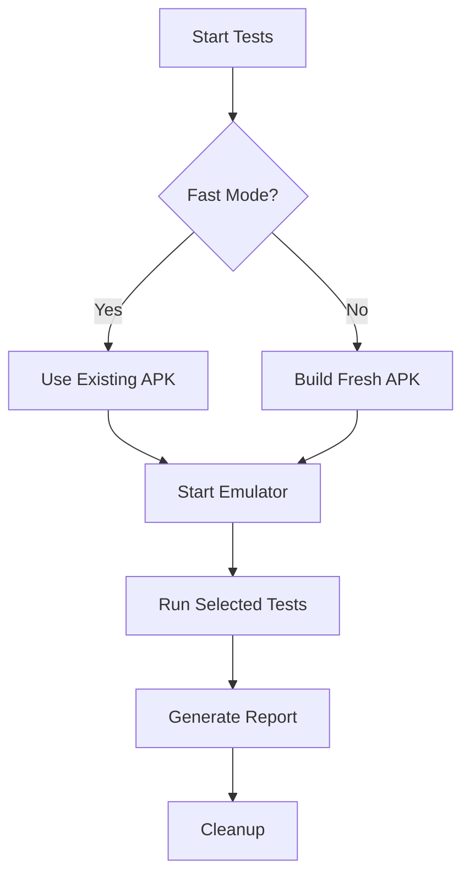

# Design Document

## Overview

This design outlines the comprehensive cleanup and reorganization of the running heatmap project to focus exclusively on mobile app development. The cleanup will remove all web-related components, consolidate server scripts, simplify the testing framework, and reorganize the project structure for better maintainability.

## Architecture

### Current Architecture
```
project/
├── web/                    # TO BE REMOVED
├── server/
│   ├── app.py             # Contains Flask web server + mobile API
│   ├── import_runs.py     # Data import script
│   ├── make_pmtiles.py    # PMTiles generation script
│   └── build_mobile.py    # Mobile build script
├── testing/
│   ├── run_tests.py       # Complex test runner with many flags
│   ├── manual_test.sh     # Manual test wrapper
│   └── test.sh           # Main test wrapper
└── data/
```

### Target Architecture
```
project/
├── mobile/
│   ├── api.py             # Clean mobile-only API server
│   ├── data_processor.py  # Consolidated import + PMTiles generation
│   └── build.py           # Mobile build script (updated)
├── testing/
│   ├── run_tests.py       # Simplified test runner
│   ├── manual_test.sh     # Manual test wrapper (unchanged)
│   └── test.sh           # Main test wrapper (unchanged)
└── data/
```

## Components and Interfaces

### 1. Web Component Removal

**Components to Remove:**
- `web/` directory and all contents
- Flask web routes from `server/app.py`
- Web-specific static file serving
- Web-related documentation sections

**API Preservation:**
- Mobile API endpoints will be extracted and preserved in `mobile/api.py`
- Essential endpoints: `/api/runs_in_area`, `/api/upload`, `/api/last_activity`, `/update_runs`
- PMTiles serving endpoint: `/runs.pmtiles`

### 2. Server Script Consolidation

**New `mobile/data_processor.py` Script:**
```python
# Combined functionality from import_runs.py + make_pmtiles.py
class DataProcessor:
    def import_runs(self, raw_dir, output_pkl)
    def generate_pmtiles(self, runs_pkl, output_pmtiles)
    def process_all(self, raw_dir, output_pkl, output_pmtiles)
```

**Command Line Interface:**
```bash
python data_processor.py --import-only          # Just import runs
python data_processor.py --pmtiles-only         # Just generate PMTiles
python data_processor.py --all                  # Import + PMTiles (default)
python data_processor.py --raw-dir DIR --output-pkl FILE --output-pmtiles FILE
```

### 3. Testing Framework Simplification

**Supported Flags (Keep):**
- `--fast`: Skip expensive operations
- `--one-test`: Interactive single test selection

**Flags to Remove:**
- `--mobile`, `--legacy`, `--integration`: Simplify to core tests only
- `--manual-emulator`, `--emulator-name`, `--keep-emulator`: Reduce emulator complexity
- `--keep-app`, `--browser`, `--report-file`: Remove less-used options
- `--verbose`: Keep basic verbosity, remove complex levels

**Simplified Test Runner:**
```python
# Simplified argument structure
parser.add_argument('--fast', help='Skip expensive operations')
parser.add_argument('--one-test', help='Interactive test selection')
parser.add_argument('tests', nargs='*', help='Specific test files')
```

### 4. Mobile API Server

**New `mobile/api.py`:**
- Lightweight Flask server focused only on mobile endpoints
- No static file serving for web content
- Optimized for mobile app communication
- Maintains all existing mobile functionality

## Data Models

### Runs Data Structure (Unchanged)
```python
runs = {
    run_id: {
        'bbox': [minx, miny, maxx, maxy],
        'geoms': {
            'full': LineString,
            'high': LineString,
            'mid': LineString,
            'low': LineString,
            'coarse': LineString
        },
        'metadata': {
            'start_time': datetime,
            'end_time': datetime,
            'distance': float,
            'duration': float,
            'activity_type': str,
            'activity_raw': str,
            'source_file': str
        }
    }
}
```

### Configuration Structure
```python
# Consolidated configuration for data processing
config = {
    'raw_data_dir': 'data/raw',
    'output_pkl': 'mobile/runs.pkl',
    'output_pmtiles': 'mobile/runs.pmtiles',
    'simplification_levels': {
        'high': 0.0001,
        'mid': 0.0005,
        'low': 0.001,
        'coarse': 0.002
    }
}
```

## Error Handling

### Data Processing Errors
- **File Format Errors**: Graceful handling of corrupted GPS files with detailed logging
- **Memory Errors**: Chunked processing for large datasets
- **Disk Space Errors**: Pre-flight checks for available space

### API Errors
- **Invalid Polygon Errors**: Validation and auto-correction for selection polygons
- **Upload Errors**: Detailed error messages for GPX upload failures
- **PMTiles Errors**: Fallback to direct API when PMTiles unavailable

### Testing Errors
- **Emulator Errors**: Clear error messages with troubleshooting steps
- **APK Build Errors**: Detailed build failure diagnostics
- **Test Environment Errors**: Automatic cleanup and retry mechanisms

## Testing Strategy

### Test Categories (Simplified)
1. **Core Tests**: Essential mobile functionality tests (default)
2. **Custom Tests**: User-specified test files
3. **Single Test**: Interactive test selection

### Test Execution Flow


### Mobile Test Coverage
- **Infrastructure Setup**: Emulator, APK installation
- **Activity Visibility**: Map loading, data display
- **Lasso Selection**: Polygon drawing, area queries
- **Upload Functionality**: GPX file uploads
- **End-to-End Flows**: Complete user workflows

## Migration Strategy

### Phase 1: Web Removal
1. Remove `web/` directory
2. Extract mobile API endpoints from `server/app.py`
3. Create new `mobile/api.py` with only mobile endpoints
4. Rename `server/` directory to `mobile/`
4. Update documentation

### Phase 2: Script Consolidation
1. Create `data_processor.py` combining import and PMTiles functionality
2. Update `build_mobile.py` to use new consolidated script
3. Test consolidated functionality
4. Remove old scripts

### Phase 3: Testing Simplification
1. Simplify `run_tests.py` argument parsing
2. Remove unused command-line flags
3. Streamline test execution logic
4. Verify all mobile tests still pass

### Phase 4: Documentation Update
1. Update README to focus on mobile development
2. Integrate MOBILE_SETUP.md content
3. Update all references to removed components
4. Add new consolidated workflow documentation

## Dependencies

### Removed Dependencies
- Flask web serving capabilities (keep Flask for API only)
- Web-specific JavaScript libraries references
- Web documentation dependencies

### Updated Dependencies
- Flask: Minimal API-only usage
- All existing mobile dependencies maintained
- Testing dependencies unchanged

## Performance Considerations

### Data Processing Performance
- Consolidated script reduces I/O overhead
- Single-pass processing for import + PMTiles generation
- Memory-efficient handling of large datasets

### API Performance
- Lighter mobile API server with reduced overhead
- No static file serving improves response times
- Maintained spatial indexing for fast queries

### Testing Performance
- Simplified test runner reduces startup overhead
- Fast mode leverages existing APK builds
- Streamlined emulator management