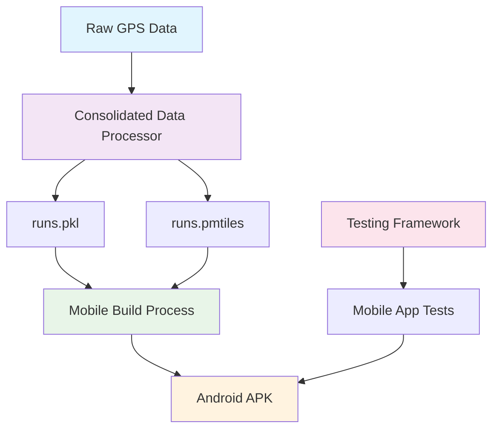

# Design Document

## Overview

This design outlines the systematic cleanup and reorganization of the running heatmap project to transform it from a dual web/mobile codebase into a streamlined mobile-only application. The cleanup will remove all web infrastructure, consolidate data processing scripts, simplify the testing framework, and optimize the project structure while preserving all mobile functionality.

## Code Reuse Analysis

### Existing Components to Leverage
- **Mobile App Core (`server/mobile_template.html`, `server/mobile_main.js`)**: Core mobile application logic will be preserved and enhanced
- **Build System (`server/build_mobile.py`)**: Mobile build pipeline will be maintained and optimized
- **Testing Infrastructure (`testing/`)**: Core testing framework will be simplified but preserved
- **Data Processing Logic**: GPS parsing, coordinate processing, and PMTiles generation logic will be consolidated

### Integration Points
- **Capacitor Mobile Framework**: Existing Capacitor configuration and plugins will be maintained
- **PMTiles Data Pipeline**: Data processing output will continue to feed into mobile app
- **Testing Automation**: Simplified test framework will maintain integration with existing test data and emulation

## Architecture

The cleanup follows a systematic removal and consolidation approach:

### Modular Design Principles
- **Single File Responsibility**: Each remaining script will handle one specific domain (data processing, mobile build, testing)
- **Component Isolation**: Mobile app components will be completely decoupled from removed web components
- **Service Layer Separation**: Clear separation between data processing, mobile app, and testing layers
- **Utility Modularity**: Shared utilities will be consolidated and mobile-focused



## Components and Interfaces

### Component 1: Consolidated Data Processor
- **Purpose:** Single script to handle GPS data import and PMTiles generation
- **Interfaces:** 
  - Input: Raw GPS files from `data/raw/`
  - Output: `runs.pkl` and `runs.pmtiles` files
  - CLI: Command-line interface with progress reporting
- **Dependencies:** `shapely`, `gpxpy`, `fitdecode`, `tippecanoe`
- **Reuses:** Combines logic from `import_runs.py` and `make_pmtiles.py`

### Component 2: Mobile Application
- **Purpose:** Standalone mobile app for GPS heatmap visualization
- **Interfaces:**
  - Template: `mobile_template.html` (enhanced from current)
  - JavaScript: `mobile_main.js` (enhanced from current)
  - Build: `build_mobile.py` (updated to use consolidated processor)
- **Dependencies:** Capacitor, MapLibre GL, PMTiles, rbush
- **Reuses:** Current mobile app logic with web dependencies removed

### Component 3: Simplified Testing Framework
- **Purpose:** Streamlined testing with essential functionality only
- **Interfaces:**
  - Entry points: `test.sh` and `manual_test.sh`
  - Flags: `--fast` and `--one-test` only
  - Test runner: Enhanced `run_tests.py`
- **Dependencies:** pytest, selenium, android testing tools
- **Reuses:** Core testing logic with complex flags removed

### Component 4: Build and Deployment
- **Purpose:** Mobile-focused build and deployment pipeline
- **Interfaces:**
  - Build script: `build_mobile.py` (updated)
  - Configuration: `capacitor.config.json`, `package.json`
  - Output: Android APK
- **Dependencies:** Node.js, Capacitor CLI, Android SDK
- **Reuses:** Current build process with web components stripped

## Data Models

### Consolidated Run Data Model
```
Run:
- id: unique identifier (integer)
- coords: array of [longitude, latitude] pairs
- metadata:
  - start_time: ISO datetime string
  - end_time: ISO datetime string  
  - distance: meters (float)
  - duration: seconds (float)
  - activity_type: normalized type (string)
  - activity_raw: original activity type (string)
  - source_file: filename (string)
- bbox: [min_lon, min_lat, max_lon, max_lat]
- geoms: simplified geometries at different resolutions
```

### PMTiles Output Model
```
PMTiles Feature:
- geometry: LineString with coordinates
- properties:
  - id: run identifier
  - start_time: ISO datetime
  - distance: meters
  - duration: seconds
  - activity_type: normalized type
  - activity_raw: original type
```

## Error Handling

### Error Scenarios

1. **Data Processing Failures**
   - **Handling:** Comprehensive try-catch with detailed error logging
   - **User Impact:** Clear error messages indicating which files failed and why

2. **Missing Dependencies**
   - **Handling:** Prerequisite checking with installation guidance
   - **User Impact:** Helpful error messages with resolution steps

3. **Mobile Build Failures**
   - **Handling:** Step-by-step build validation with rollback capabilities
   - **User Impact:** Clear indication of which build step failed

4. **Test Framework Issues**
   - **Handling:** Graceful degradation when optional test features unavailable
   - **User Impact:** Tests continue with reduced functionality rather than failing

## Testing Strategy

### Unit Testing
- Test consolidated data processor with various GPS file formats
- Test mobile app components in isolation
- Test simplified testing framework flag processing

### Integration Testing
- End-to-end data processing pipeline testing
- Mobile app build and deployment testing
- Cross-platform compatibility testing

### Migration Testing
- Before/after functionality comparison
- Performance benchmarking of consolidated vs separate scripts
- Mobile app feature parity validation

## Implementation Phases

### Phase 1: Preparation and Analysis
- Analyze dependencies and identify web-specific components
- Create migration scripts for testing rollback

### Phase 2: Web Infrastructure Removal
- Remove `web/` directory and contents
- Strip web-serving code from `server/app.py`
- Update documentation and build scripts
- Remove web-specific dependencies

### Phase 3: Data Processing Consolidation
- Create new `process_data.py` combining import and PMTiles logic
- Update mobile build process to use consolidated script
- Test data processing pipeline thoroughly
- Remove old `import_runs.py` and `make_pmtiles.py`

### Phase 4: Testing Framework Simplification
- Modify test runner to support only essential flags
- Remove complex flag processing logic
- Update test documentation
- Validate all existing tests still pass

### Phase 5: Final Optimization
- Clean up project structure
- Update all documentation
- Performance testing and optimization
- Final validation of mobile app functionality

## Risk Mitigation

### Data Loss Prevention
- Git version control provides full history and rollback capability
- Incremental changes with validation at each step
- Rollback procedures documented and tested

### Functionality Preservation
- Comprehensive testing at each phase
- Feature parity validation throughout process
- User acceptance testing before finalization

### Build System Reliability
- Build process validation in clean environment
- Dependency management verification
- Cross-platform testing