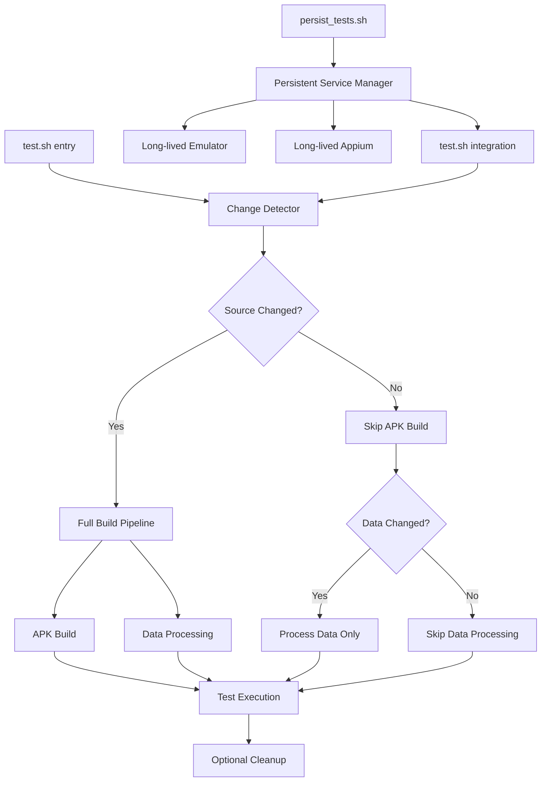

# Design Document

## Overview

This design implements comprehensive test optimization for the running heatmap mobile testing infrastructure while preserving full functionality and coverage. The solution focuses on intelligent change detection, automatic build skipping, optional persistent infrastructure, and parallel execution to maximize performance improvements.

The design maintains the existing `./test.sh` interface while adding optimization layers and an optional persistent infrastructure mode via a separate script.

## Code Reuse Analysis

### Existing Components to Leverage

- **conftest.py fixtures**: Extend `session_setup` and `mobile_driver` fixtures for change detection logic
- **run_tests.py test runner**: Enhance existing runner with optimization features (keep same file)
- **build_mobile.py**: Wrap with change detection to skip when source unchanged
- **process_data.py**: Add timestamp-based incremental processing
- **Base test classes**: Utilize `BaseMobileTest` and `MapLoadDetector` without changes
- **ADB and emulator management**: Extend existing emulator startup/configuration logic
- **Appium server management**: Build upon existing server lifecycle management

### Integration Points

- **pytest fixtures**: Enhance existing session-scoped fixtures with change detection capabilities  
- **Configuration system**: Extend `config.py` with optimization settings
- **File system**: Integrate with existing test data paths and APK build locations
- **Process management**: Leverage existing subprocess handling for builds and services
- **Cleanup mechanisms**: Modularize existing cleanup logic for reuse across scripts

## Architecture

The optimization system uses intelligent change detection to skip expensive operations:



### Modular Design Principles

- **Change Detection**: Isolated dependency tracking using file timestamps
- **Service Management**: Separate modules for emulator, Appium, and cleanup operations
- **Test Orchestration**: Parallel execution controller with fallback mechanisms
- **Build Optimization**: Smart build skipping based on source file monitoring

## Components and Interfaces

### Change Detector (`testing/change_detector.py`)  
- **Purpose:** File timestamp-based dependency tracking to skip unnecessary builds
- **Interfaces:**
  - `has_source_changed(base_path) -> bool`
  - `has_data_changed(data_path) -> bool` 
  - `update_baseline(paths)`
  - `should_rebuild_apk() -> bool`
- **Dependencies:** pathlib, existing project structure
- **Reuses:** Project structure from existing paths

### Service Manager (`testing/service_manager.py`)
- **Purpose:** Lifecycle management for emulator and Appium services  
- **Interfaces:**
  - `start_emulator_if_needed() -> EmulatorInfo`
  - `start_appium_if_needed() -> ProcessInfo`
  - `health_check_services() -> ServiceStatus`
  - `cleanup_services(force=False)`
- **Dependencies:** subprocess, psutil  
- **Reuses:** Existing emulator configuration from conftest.py

### Parallel Test Controller (`testing/parallel_controller.py`)
- **Purpose:** Safe parallel test execution with dependency analysis
- **Interfaces:**
  - `analyze_test_dependencies(test_files) -> DependencyGraph`
  - `execute_parallel_safe(test_groups) -> Results`
  - `fallback_sequential(test_files) -> Results`
- **Dependencies:** pytest, multiprocessing
- **Reuses:** Existing test discovery and execution patterns

### Enhanced Test Runner (modify existing `testing/run_tests.py`)
- **Purpose:** Orchestrates optimized test execution with change detection
- **Interfaces:**
  - `run_optimized_tests(args) -> TestResults`
  - `prepare_optimized_environment() -> EnvironmentInfo`
  - `execute_with_optimizations(test_plan) -> Results`
- **Dependencies:** All optimization components
- **Reuses:** Existing run_tests.py structure and argument parsing (same file, enhanced)

### Persistent Infrastructure Script (`testing/persist_tests.sh`)
- **Purpose:** Optional persistent service mode for multiple test runs
- **Interfaces:**
  - Command line: `./persist_tests.sh start|stop|status|cleanup`
  - Integration with existing `./test.sh`
- **Dependencies:** Service manager, cleanup utilities
- **Reuses:** Modularized cleanup logic from conftest.py

### Documentation Update (`testing/README.md`)
- **Purpose:** Comprehensive documentation rewrite covering all optimization features
- **Content:** Usage instructions, optimization modes, troubleshooting, performance tips
- **Dependencies:** All optimization components
- **Reuses:** Existing project context and structure

## Data Models

### ChangeReport
```python
@dataclass  
class ChangeReport:
    has_changes: bool            # Any changes detected
    changed_files: List[Path]    # Specific files that changed
    change_type: ChangeType      # SOURCE, DATA, CONFIG, etc.
    baseline_time: datetime      # Last check timestamp
    skip_build: bool             # Whether to skip APK build
    skip_data: bool              # Whether to skip data processing
```

### ServiceStatus
```python
@dataclass
class ServiceStatus:
    emulator_running: bool       # Emulator health
    appium_running: bool         # Appium server health
    services_healthy: bool       # Overall health
    startup_time: float          # Time to start services
    restart_needed: bool         # Whether restart recommended
```

### BuildOptimization
```python
@dataclass
class BuildOptimization:
    apk_exists: bool             # APK file exists and is valid
    source_unchanged: bool       # Source files haven't changed
    data_unchanged: bool         # Test data files haven't changed
    can_skip_build: bool         # Safe to skip APK build
    can_skip_data: bool          # Safe to skip data processing
```

## Error Handling

### Error Scenarios

1. **Change Detection Failure**: 
   - **Handling:** Default to full build if change detection fails
   - **User Impact:** Warning message, fallback to traditional build process

2. **Parallel Execution Failure**:
   - **Handling:** Automatic fallback to sequential execution
   - **User Impact:** Informational message about fallback, tests complete successfully

3. **Service Startup Failure**:
   - **Handling:** Retry with exponential backoff, fallback to traditional startup
   - **User Impact:** Extended startup time, clear error messages

4. **Persistent Mode Service Crash**:
   - **Handling:** Auto-restart services, fallback to isolated mode if repeated failures
   - **User Impact:** Brief delay, automatic recovery notification

## Implementation Phases

### Phase 1: Core Change Detection Infrastructure
- Implement Change Detector for source and data files
- Add change detection to existing build processes
- Extend existing fixtures with optimization logic

### Phase 2: Service Management
- Create Service Manager for persistent infrastructure
- Implement health monitoring and auto-restart
- Modularize cleanup logic for reuse

### Phase 3: Parallel Execution
- Build Parallel Test Controller with dependency analysis
- Implement safe parallelization with fallbacks
- Add performance monitoring and reporting

### Phase 4: Integration and Documentation
- Enhance existing run_tests.py with orchestration
- Implement `persist_tests.sh` script
- Comprehensively rewrite `testing/README.md`
- Add comprehensive error handling and recovery

## Performance Optimization Details

**APK Build Optimization**: 
- Monitor source file modifications in `server/`, `mobile/`, and build configuration
- Check if existing APK is newer than source files
- Skip APK build entirely when source unchanged, use existing APK from output folder

**Data Processing Optimization**:
- Monitor GPX file timestamps in `testing/test_data/`
- Check if PMTiles are newer than source GPX files
- Skip data processing when test data unchanged, use existing PMTiles

**Service Persistence**:
- Keep emulator warm between test runs in persistent mode
- Maintain Appium server across multiple executions
- Implement graceful degradation when services become unhealthy

**Parallel Execution Safety**:
- Analyze test interdependencies through fixture usage
- Execute independent tests concurrently
- Serialize tests with shared state (emulator, APK installation)