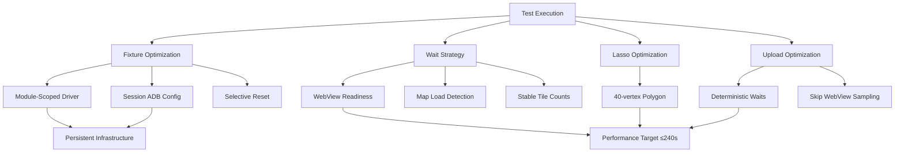

# Test Runtime Optimization Design Document

## Overview

This design optimizes the existing test suite from ~408s to ≤240s runtime through targeted improvements to deterministic waits, fixture scoping, and lasso selection efficiency. The approach leverages existing infrastructure (persist_tests.sh, change_detector.py, optimization caching) while minimizing code additions to address codebase growth concerns.

## Code Reuse Analysis

### Existing Components to Leverage
- **persist_tests.sh**: Infrastructure persistence - no duplication needed
- **change_detector.py**: Build optimization system - extend for fixture optimization tracking
- **conftest.py**: Session-scoped fixtures - modify mobile_driver scope and add stability configuration
- **base_mobile_test.py**: Test utilities - enhance with deterministic wait helpers
- **map_load_detector.py**: Map readiness detection - extend with stable tile count verification

### Integration Points
- **pytest fixture system**: Modify existing mobile_driver fixture scope from function to module
- **ADB stability configuration**: Extend existing configure_emulator_stability() function in conftest.py
- **Appium WebDriver management**: Enhance existing driver cleanup patterns with reset() methodology
- **Performance monitoring**: Integrate with existing PerformanceMetrics class in run_tests.py

## Architecture

### Modular Design Principles
- **Single File Responsibility**: Each optimization targets specific bottleneck areas
- **Minimal Code Addition**: Reuse existing infrastructure with targeted enhancements
- **Backward Compatibility**: All changes must work with existing test execution modes
- **Graceful Degradation**: Optimizations fail back to current behavior when issues occur



## Components and Interfaces

### Component 1: Fixture Optimization System
- **Purpose:** Convert mobile_driver from function-scoped to module-scoped with selective reset capability
- **Interfaces:** 
  - `@pytest.fixture(scope="module")` mobile_driver modification
  - `@pytest.mark.needs_clean_state` decorator for selective resets
  - `driver.reset()` method for state cleanup
- **Dependencies:** Existing conftest.py, pytest markers system
- **Reuses:** configure_emulator_stability(), cleanup utilities, existing driver management

### Component 2: Deterministic Wait System
- **Purpose:** Replace time.sleep() calls with explicit readiness polling
- **Interfaces:**
  - `wait_for_webview_ready(driver, timeout=30)` - WebView context attachment
  - `wait_for_map_stable(driver, wait, timeout=45)` - Map loading + stable tiles
  - `wait_for_layers_stable(driver, expected_count, timeout=30)` - Activity visibility
- **Dependencies:** Existing WebDriverWait, base_mobile_test.py patterns
- **Reuses:** map_load_detector.py logic, existing map readiness detection

### Component 3: Lasso Selection Optimizer
- **Purpose:** Reduce pointer events from 110 to ~40 vertices while maintaining coverage
- **Interfaces:**
  - `generate_optimized_polygon(center, radius, vertices=40)` - Optimized polygon generation
  - Geometric coverage validation ensuring convex, concave, and edge-crossing test cases
- **Dependencies:** Existing lasso selection logic in test_basic_lasso_selection.py
- **Reuses:** W3C touch actions, coordinate projection system, polygon generation

### Component 4: Upload Test Optimizer
- **Purpose:** Optimize upload testing through deterministic waits and WebView branch skipping
- **Interfaces:**
  - `wait_for_picker_ready(driver, timeout=10)` - File picker readiness
  - `skip_webview_sampling()` - Conditional pixel sampling bypass
  - Enhanced deterministic waits in upload flow
- **Dependencies:** Existing upload test flow in test_upload_functionality.py
- **Reuses:** Native picker interaction, post-upload verification logic

## Data Models

### OptimizationConfig
```python
@dataclass
class OptimizationConfig:
    fixture_scope: str = "module"  # "function" or "module"
    deterministic_waits: bool = True
    lasso_vertices: int = 40  # Optimized polygon complexity
    skip_webview_sampling: bool = True
    needs_clean_state_marker: str = "needs_clean_state"
```

### WaitConfiguration
```python
@dataclass
class WaitConfiguration:
    webview_timeout: int = 30
    map_stable_timeout: int = 45
    layer_stable_timeout: int = 30
    tile_stability_checks: int = 3  # Consecutive stable checks required
    polling_interval: float = 0.5
```

### PolygonConfig
```python
@dataclass
class PolygonConfig:
    vertices: int = 40  # Optimized vertex count
    convex_ratio: float = 0.6  # 60% convex, 40% concave points
    edge_crossing_points: int = 4  # Points that create edge crossings
```

## Error Handling

### Error Scenarios

1. **Deterministic Wait Timeout:**
   - **Handling:** Log detailed state information, fall back to original sleep-based approach
   - **User Impact:** Test continues with longer execution time, clear timeout logging

2. **Module-Scoped Driver State Pollution:**
   - **Handling:** Detect state pollution, trigger driver.reset(), retry test execution
   - **User Impact:** Automatic recovery, test reruns once, failure logged if persistent

3. **Persistent Infrastructure Unavailable:**
   - **Handling:** Automatically detect and fall back to isolated mode execution
   - **User Impact:** Tests continue normally, infrastructure startup time included in measurement

4. **Lasso Vertex Reduction Geometry Failure:**
   - **Handling:** Fall back to original 110-vertex polygon, log geometry calculation error
   - **User Impact:** Test continues with original timing, geometry error logged for investigation

## Testing Strategy

### Unit Testing
- **Deterministic Wait Functions:** Test timeout handling, polling intervals, state detection accuracy
- **Polygon Generation:** Validate geometric coverage equivalent between optimized and original versions
- **Fixture Scoping:** Verify state isolation between modules, clean state marker functionality

### Integration Testing
- **End-to-End Runtime:** Validate ≤240s target across 5 consecutive runs with variance tracking
- **Persistence Integration:** Test seamless integration with existing persist_tests.sh workflow
- **Fallback Scenarios:** Verify graceful degradation when optimizations fail

### End-to-End Testing
- **Coverage Parity Validation:** Comprehensive mapping of before/after test coverage
- **Performance Regression:** Automated detection of runtime improvements and variance analysis
- **Flakiness Monitoring:** Track test stability improvements through deterministic waits

## Implementation Phases

### Phase 1: Deterministic Wait System
**Duration:** 2-3 days
**Scope:** Replace sleep() calls with explicit readiness signals
**Files Modified:**
- `testing/base_mobile_test.py` - Add wait helper functions
- `testing/test_*.py` - Replace time.sleep() with deterministic waits
- `testing/map_load_detector.py` - Enhance with stable tile count detection

**Risk Mitigation:** Each wait function includes timeout fallback to original behavior

### Phase 2: Fixture Optimization
**Duration:** 1-2 days  
**Scope:** Convert mobile_driver to module scope with selective reset
**Files Modified:**
- `testing/conftest.py` - Change fixture scope, add reset logic
- `testing/test_*.py` - Add @pytest.mark.needs_clean_state where needed
- `testing/config.py` - Add fixture optimization configuration

**Risk Mitigation:** Comprehensive state isolation testing, rollback capability

### Phase 3: Lasso Selection Optimization
**Duration:** 1 day
**Scope:** Reduce polygon complexity to 40 vertices while maintaining coverage
**Files Modified:**
- `testing/test_basic_lasso_selection.py` - Implement optimized 40-vertex polygon

**Risk Mitigation:** Geometric validation ensures coverage equivalence, fallback to original polygon

### Phase 4: Upload Test Optimization  
**Duration:** 1 day
**Scope:** Optimize upload testing deterministic waits and skip impossible WebView operations
**Files Modified:**
- `testing/test_upload_functionality.py` - Replace upload flow sleeps, skip WebView pixel sampling

**Risk Mitigation:** Maintain existing native picker flow, only optimize wait conditions

### Phase 5: Integration and Validation
**Duration:** 2 days
**Scope:** Performance validation, integration testing, documentation updates
**Files Modified:**
- `testing/README.md` - Document optimization markers and usage
- Performance validation scripts and measurement

**Risk Mitigation:** Comprehensive regression testing, rollback plan preparation

## Performance Targets

### Runtime Breakdown (Current → Optimized)
- **Infrastructure startup:** 86s → 0s (with persistence)
- **Deterministic waits:** ~180s → ~90s (eliminate unnecessary sleeps)
- **Lasso selection:** ~90s → ~45s (reduced vertices)  
- **Test execution overhead:** ~52s → ~45s (fixture optimization)
- **Upload testing:** ~110s → ~90s (deterministic waits, skip WebView sampling)

**Total Target:** 408s → ≤240s (41% reduction)

### Success Metrics
- **Median runtime over 5 runs:** ≤240s
- **Runtime variance:** <10% between consecutive runs
- **Flakiness rate:** No increase from baseline
- **Coverage parity:** 100% functional equivalent mapping documented